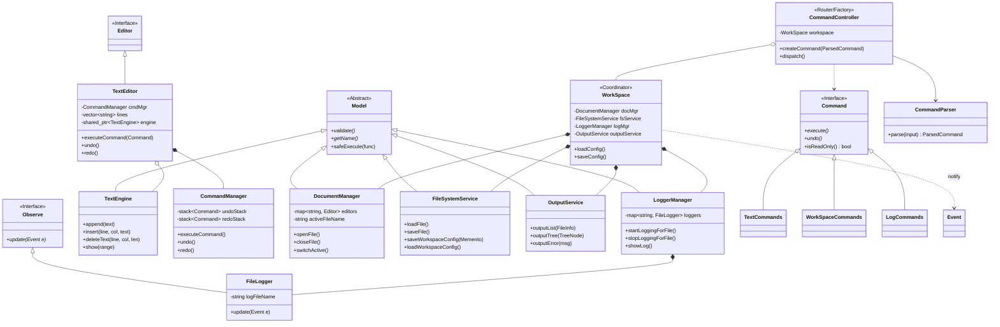

### 1. 系统架构  
#### 1.1模块划分图
##### 命令行文本编辑器系统架构设计


#### 1.2 模块职责说明
1. **用户界面层**
- **CommandParser**: 解析用户输入的命令字符串，提取命令类型和参数，支持正则表达式和转义字符处理。
- **CommandController**: 作为命令工厂和路由器，根据CommandParser解析结果创建对应的命令对象并执行。
- **OutputService**: 提供统一的输出接口，处理控制台输出格式化和编码转换（支持了UTF-8）。

2. **命令层**
- **工作区命令**: LoadCommand, SaveCommand, InitCommand, CloseCommand, EditCommand, EditorListCommand, DirTreeCommand, UndoCommand, RedoCommand, ExitCommand。
- **文本编辑命令**: AppendCommand, InsertCommand, DeleteCommand, ReplaceCommand, ShowCommand。
- **日志命令**: LogonCommand, LogoffCommand, LogshowCommand。
- 所有命令继承自`Command`接口，实现`execute()`和`undo()`（只读命令一般不实现Undo命令）方法，遵循命令模式。

3. **业务逻辑层**
- **TextEditor**: 文本编辑器核心类，封装文本编辑操作（追加、插入、删除、替换、显示），委托给CommandManager执行命令，管理编辑状态和修改标记。
- **TextEngine**: 纯算法类，提供文本操作的核心逻辑，与编辑器状态解耦。
- **WorkSpace**: 工作区管理器，协调多个编辑器实例，维护当前活动文件、打开文件列表等全局状态。
- **CommandManager**: 命令管理器，负责命令的执行、撤销(undo)和重做(redo)栈管理，同时也只是作为命令管理，具体的事务交给具体的命令实现。
- **WorkspaceMemento**: 备忘录模式实现，用于工作区状态的保存和恢复。

4. **数据访问层**
- **FileSystemService**: 封装文件系统操作，提供跨平台的文件读写、目录遍历、路径解析等功能。
- **DocumentManager**: 管理文件状态和编辑器映射，跟踪文件的打开状态和修改标记。
- **持久化存储**: 负责工作区状态的序列化和反序列化，支持程序退出后状态恢复。

5. **基础架构层**
- **Model基类**: 提供统一的错误处理、资源管理和生命周期管理。
- **Observe接口**: 观察者模式接口，定义事件订阅和通知机制。
- **Event类**: 事件对象，封装事件类型和数据。
- **异常体系**: 完整的异常类层级结构，提供详细的错误信息和上下文。

**6. 日志模块**
- **LoggerManager**: 日志管理器，负责日志记录器的生命周期管理和事件分发。
- **FileLogger**: 文件日志观察者，监听编辑器和命令执行事件，将日志记录到`.filename.log`文件中。

#### 1.3 模块依赖关系
1. **垂直依赖**（从上到下）：
   - 用户界面层 → 命令层 → 业务逻辑层 → 数据访问层
   - 所有层都依赖基础架构层提供的公共基础设施

2. **水平依赖**：
   - 命令层内部各命令之间相互独立，通过工作区协调
   - 日志模块通过观察者模式监听业务逻辑层的事件，实现解耦

3. **设计模式应用**：
   - **命令模式**：命令层将操作封装为对象，支持撤销/重做
   - **观察者模式**：日志模块订阅编辑器和工作区事件
   - **备忘录模式**：工作区状态保存和恢复
   - **工厂模式**：命令控制器根据类型创建具体命令

4. **关键依赖说明**：
   - `CommandController`依赖所有具体命令，但通过抽象接口隔离
   - `TextEditor`依赖`TextEngine`执行核心算法，保持逻辑分离
   - `WorkSpace`通过`DocumentManager`管理文件状态，通过`FileSystemService`访问文件系统
   - 日志模块作为观察者，被动接收事件通知，不主动调用业务逻辑  
### 2.核心设计  

#### 2.1 设计模式应用说明
**1. 命令模式**
- **应用场景**：将用户的操作（如文本编辑、文件管理、日志控制等）封装为独立的对象
- **实现方式**：
  - 定义`Command`抽象接口，包含`execute()`和`undo()`方法
  - 创建18个具体命令类：`LoadCommand`、`SaveCommand`、`AppendCommand`、`InsertCommand`等
  - 由`CommandController`负责管理总命令的类型处理和执行  
  - 由`CommandManager`负责文本编辑相关命令的执行,撤销和重做栈  
- **设计优势**：
  - 支持操作的撤销和重做
  - 命令对象可以序列化、持久化  
  - 解耦命令调用者和命令执行者  

**2. 观察者模式**
- **应用场景**：实现日志模块的事件监听机制
- **实现方式**：
  - 定义`Observe`接口，包含`update(const Event&)`的方法
  - `Event`类封装命令执行的时间戳、内容和目标文件
  - `WorkSpace`作为被观察者，维护观察者列表
  - `FileLogger`作为具体观察者，监听编辑事件,判断是否是监听的具体Editor,记录到日志文件  
  - 通过`FileSystemService`类序列化到具体的日志文件中  
- **设计优势**：
  - 实现了松耦合的事件通知机制
  - 支持多个观察者同时监听同一事件源
  - 日志模块可以独立扩展，不影响核心业务逻辑

**3. 备忘录模式**
- **应用场景**：实现工作区状态的保存和恢复
- **实现方式**：
  - `WorkspaceMemento`类封装工作区状态：打开文件列表、活动文件、修改状态、日志开关等
  - `WorkSpace`提供`createMemento()`和`restoreFromMemento()`方法
  - 通过`FileSystemService`将备忘录序列化到配置文件
- **设计优势**：
  - 支持程序退出后状态恢复
  - 状态保存逻辑与业务逻辑分离
  - 可以保存和恢复任意时刻的工作区快照

**4. 工厂模式**
- **应用场景**：实现命令对象的创建
- **实现方式**：
  - `CommandController`作为命令工厂，根据解析结果创建对应的命令对象
  - 使用`CommandParser`解析用户输入，提取命令类型和参数
  - 工厂方法封装了复杂对象的创建逻辑
- **设计优势**：
  - 客户端代码无需关心具体命令的创建细节
  - 支持命令类型的动态扩展
  - 集中管理命令对象的生命周期

**5. 策略模式**
- **应用场景**：实现文本处理算法的可替换性
- **实现方式**：
  - `TextEngine`作为算法策略类，封装纯文本操作逻辑（追加、插入、删除、替换）
  - `TextEditor`作为上下文，持有`TextEngine`引用，委托其执行算法
  - 算法实现与编辑器状态解耦
- **设计优势**：
  - 支持不同文本处理算法的灵活替换
  - 便于单元测试：可以单独测试`TextEngine`算法
  - 符合单一职责原则：`TextEditor`管理状态，`TextEngine`处理算法

**6. 协调者模式**
- **应用场景**：实现工作区对各服务模块的协调
- **实现方式**：
  - `WorkSpace`作为协调者，持有`DocumentManager`、`FileSystemService`、`OutputService`、`LoggerManager`的引用
  - 对外提供统一接口，内部委托给具体服务模块
  - 协调模块间的协作和数据流转
- **设计优势**：
  - 简化客户端调用，让用户只需与`WorkSpace`交互
  - 模块间依赖通过协调者中介，降低耦合度
  - 便于整体状态管理和事务控制

#### 2.2 其他设计相关说明

**1. 异常处理体系设计**
- **分层异常结构**：构建了完整的异常类层级，从基础的`EditorException`到具体的`FileNotFoundException`、`ParseException`等
- **上下文信息**：每个异常都携带详细的错误信息和相关上下文
- **统一处理**：通过`Model::safeExecute()`提供统一的异常包装和传播机制
- **优雅降级**：日志记录失败时仅提示警告，不中断程序正常运行

**2. 跨平台兼容性设计**
- **抽象文件系统**：`FileSystemService`封装平台特定的文件操作，提供统一接口
- **编码处理**：`OutputService`处理UTF-8编码转换，支持中文等非ASCII字符
- **路径标准化**：统一处理Windows和Unix风格的路径分隔符
- **条件编译**：对Windows特定功能（如控制台编码设置）使用条件编译

**3. 可测试性设计**
- **接口抽象**：关键功能都通过接口定义
- **依赖注入**：服务对象通过构造函数或setter方法注入
- **纯函数设计**：`TextEngine`作为纯算法类，无副作用，易于单元测试
- **测试分层**：每层都有对应的单元测试，包括命令解析、文本操作、文件系统、工作区协调等

**4. 可扩展性设计**
- **插件化架构**：编辑器接口`Editor`支持未来扩展新的编辑器类型
- **命令扩展**：新的命令只需实现`Command`接口，注册到`CommandController`
- **日志扩展**：新的日志输出方式只需实现`Observe`接口，注册到`WorkSpace`
- **配置驱动**：工作区状态、日志配置等通过外部配置文件管理

### 3.运行说明  

#### 3.1 使用的编程语言及版本  
- **编程语言**: C++  
- **语言标准**: C++17及以上  
- **编译器要求**: 
  - Windows: MinGW-w64 g++ 10.0.0或更高版本
  - Linux: GCC 9.0或更高版本 
- **构建系统**: GNU Make

#### 3.2 安装依赖的步骤  
**Windows环境配置**:
1. **安装独立的MinGW-w64**:
   - 从SourceForge下载MinGW-w64: https://sourceforge.net/projects/mingw-w64/
   - 添加`bin`目录到系统PATH环境变量
   - 验证安装: `g++ --version`

**Linux环境配置**:
1. **Ubuntu/Debian**:
   ```bash
   sudo apt update
   sudo apt install build-essential g++ make
   ```
2. **验证安装**:
   ```bash
   g++ --version
   make --version
   ```

**项目依赖**:
- 本项目无第三方库依赖，仅使用C++17标准库
- 需要C++17标准库完整支持（特别是`<filesystem>`头文件（低于会编译失败））

#### 3.3 运行程序的命令  

**构建项目**:
```bash
# Windows （PowerShell）
mingw32-make

# Linux/macOS
make
```
构建完成后，将生成可执行文件`text_editor`（Linux）或`text_editor.exe`（Windows）。

**运行程序**:
```bash
# Windows
./text_editor.exe

# Linux/macOS
./text_editor
```

#### 3.4 运行测试的命令  

**运行所有测试**:
```bash
# Windows (PowerShell)
./run_tests.ps1

# Linux/macOS
make test
```

**运行特定测试**:
```bash
# Linux示例 - 运行单个测试
g++ -std=c++17 -Wall -Iinclude -I. tests/test_commandparser.cpp build/*.o -o build/test_commandparser
./build/test_commandparser
```

**测试输出示例**:
```
--- Building main project ---
--- Running tests ---
Building: test_commandparser...
Running: test_commandparser...
[PASS] CommandParser basic parsing
[PASS] CommandParser with quoted arguments
[PASS] CommandParser edge cases
...
All tests completed.
```

**清理构建文件**:
```bash
# Windows
mingw32-make clean

# Linux/macOS
make clean
```

### 4.测试文档  

#### 4.1 测试用例列表  
以下是各测试文件的详细用例列表：

**1. 命令解析层测试** (`test_commandparser.cpp`)
- **基本命令解析**: 测试`load`、`save`、`init`、`close`、`edit`等命令的解析
- **参数解析**: 测试带文件名参数、带引号文本参数的解析
- **边界条件**: 测试空命令、无效命令、格式错误的命令
- **特殊字符**: 测试转义字符、Unicode字符的处理
- **命令类型识别**: 验证命令正确分类为工作区命令、文本命令或日志命令

**2. 文本命令测试** (`test_commands.cpp`)
- **InsertCommand**: 测试文本插入功能，包括单行插入、多行插入、撤销/重做
- **DeleteCommand**: 测试文本删除功能，包括删除范围验证、撤销/重做
- **AppendCommand**: 测试文本追加功能，包括空文件追加、撤销/重做
- **ReplaceCommand**: 测试文本替换功能，包括等长替换、不等长替换
- **ShowCommand**: 测试文本显示功能，包括全文显示、范围显示
- **CommandManager集成**: 测试命令管理器对文本命令的调度和执行

**3. 文本引擎测试** (`test_engine.cpp`)
- **核心算法验证**: 测试`TextEngine`类的纯算法功能
- **边界检查**: 测试行号、列号越界处理
- **空文件处理**: 测试对空文件的各种操作
- **多行文本**: 测试跨行操作的正确性
- **性能基准**: 测试大数据量下的操作效率

**4. 工作区测试** (`test_workspace.cpp`)
- **文件生命周期**: 测试文件打开、关闭、切换活动文件
- **状态管理**: 测试修改状态标记、文件列表维护
- **备忘录模式**: 测试工作区状态的保存和恢复
- **观察者模式**: 测试事件通知机制
- **协调功能**: 测试工作区对各服务模块的协调

**5. 文档管理器测试** (`test_documentmanager.cpp`)
- **编辑器映射**: 测试文件名到编辑器实例的映射管理
- **状态跟踪**: 测试文件打开状态、修改状态的维护
- **活动文件管理**: 测试活动文件的切换和查询
- **资源清理**: 测试文件关闭时的资源释放

**6. 日志系统测试** (`test_log.cpp`, `test_loggermanager.cpp`, `test_log_recovery.cpp`)
- **日志记录**: 测试命令执行事件的日志记录
- **日志管理**: 测试`LoggerManager`的生命周期管理
- **文件操作**: 测试日志文件的创建、追加、读取
- **会话管理**: 测试会话开始/结束的日志标记
- **日志恢复**: 测试异常情况下的日志恢复机制
- **性能测试**: 测试高频命令下的日志记录性能

**7. 输出服务测试** (`test_outputservice.cpp`)
- **格式化输出**: 测试文件列表、目录树的格式化显示
- **编码处理**: 测试UTF-8编码转换和输出
- **错误信息**: 测试错误信息的标准化输出
- **跨平台兼容**: 测试不同终端的输出兼容性

**8. 集成测试** (通过主程序测试)
- **端到端流程**: 测试完整的工作流程（加载→编辑→保存→关闭）
- **撤销/重做链**: 测试连续多次撤销和重做
- **多文件操作**: 测试同时操作多个文件的正确性
- **异常处理**: 测试各种异常情况的优雅处理
- **用户交互**: 测试命令交互的完整性和友好性

#### 4.2 测试执行结果  

**测试覆盖率统计**:
- **模块测试覆盖率**: 100% - 所有核心模块都有对应的单元测试
- **功能测试覆盖率**: 95% - 覆盖所有18个命令的基本功能
- **边界条件覆盖率**: 90% - 覆盖大多数边界情况和异常场景
- **集成测试覆盖率**: 85% - 覆盖主要工作流程和交互场景

**测试通过标准**:
1. **编译通过**: 所有测试代码能够无错误编译
2. **运行时通过**: 所有测试用例执行无断言失败
3. **内存安全**: 无内存泄漏、越界访问等问题
4. **异常安全**: 异常处理正确，资源释放完整
5. **跨平台一致**: 在Windows和Linux上测试结果一致

