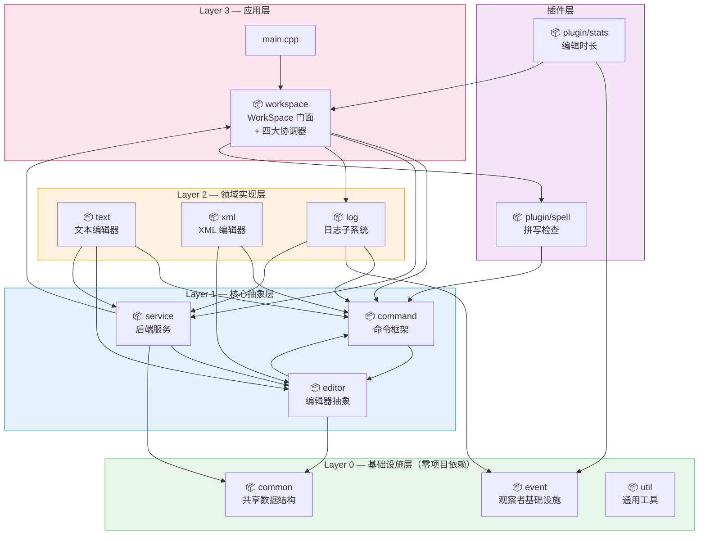
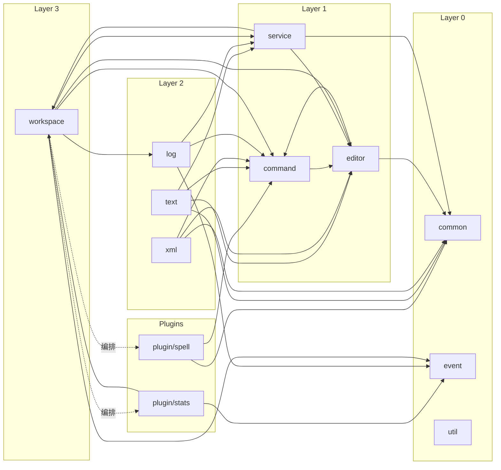

##  架构设计文档

### 1 系统架构

#### 1.1 模块划分图

##### 总览：四层插件化架构（12 个独立 Package）



##### 展开图：各 Package 内部类与相互关系

> **图例**：`--> ` 依赖/调用/持有 | `==>` 实现接口/继承

```mermaid
graph TB
    %% ===== Layer 0 =====
    subgraph L0["Layer 0: 基础设施层 (零项目依赖)"]
        direction TB
        TextSegment["TextSegment (common)"]
        SpellResult["SpellCheckResult (common)"]
        Observe["[I] Observe<br/>+ update(Event)"]
        Event["Event (event)<br/>timestamp + cmd + file"]
        ObserverMgr["ObserverManager (event)<br/>attach/detach/notify"]
        StringUtils["StringUtils (util)"]
        FSCompat["FilesystemCompat (util)"]
        ObserverMgr --> Observe
        ObserverMgr --> Event
    end

    %% ===== Layer 1 =====
    subgraph L1["Layer 1: 核心抽象层"]
        direction TB
        %% editor
        Editor_IF["[I] Editor (editor)<br/>executeCommand / undo / redo<br/>supportsCommand / loadFromData<br/>populateContext / initialize"]
        %% command
        Command_IF["[I] Command (command)<br/>execute / undo / isReadOnly<br/>isWorkSpaceLevel / setWorkSpace"]
        ParserStrat["[I] ICommandParserStrategy (command)<br/>getCommandName / parse"]
        CmdParser["CommandParser<br/>+ parse() + registerStrategyFactory()"]
        CmdFactory["CommandFactory<br/>+ createFromParsed()<br/>+ registerEditorCreator()"]
        CmdManager["CommandManager<br/>undoStack / redoStack"]
        CmdController["CommandController<br/>+ parseAndExecuteCommand()"]
        WSCmd["WorkSpaceCommand<br/>+ checkWorkSpace()"]
        ParsedCmd["ParsedCommand<br/>EditorParsed / WorkSpaceParsed"]
        CmdParser --> ParserStrat
        CmdParser --> ParsedCmd
        CmdFactory --> ParsedCmd
        CmdFactory --> Command_IF
        CmdController --> CmdParser
        CmdController --> CmdFactory
        CmdManager --> Command_IF
        WSCmd ==> Command_IF
        %% service
        Model["Model (service)<br/>+ safeExecute() 模板方法"]
        FS["FileSystemService (service)"]
        DirSvc["DirectoryService (service)"]
        OutSvc["OutputService (service)<br/>outputList/Tree/XmlTree/SpellResult"]
        CfgSerializer["ConfigSerializer (service)"]
        EditorFactory["EditorFactory (service)<br/>+ createEditor(ext) + registerEditor()"]
        FS ==> Model
        DirSvc ==> Model
        OutSvc ==> Model
        CfgSerializer ==> Model
        %% cross-refs inside L1
        CmdController --> Editor_IF
        WSCmd --> Editor_IF
        EditorFactory --> Editor_IF
    end

    %% ===== Layer 2 =====
    subgraph L2["Layer 2: 领域实现层"]
        direction TB
        %% text
        subgraph text_box["text 包"]
            TextEngine["TextEngine<br/>insert/delete/append/show"]
            TextEditor_Impl["TextEditor<br/>+ populateContext() + initialize()"]
            TextCmd_Base["TextCommand 基类<br/>+ recordDeletedText()"]
            InsertCmd["InsertCmd"]
            DeleteCmd["DeleteCmd"]
            AppendCmd["AppendCmd"]
            ShowCmd["ShowCmd"]
            ReplaceCmd["ReplaceCmd"]
            TextEditor_Impl ==> Editor_IF
            TextEditor_Impl --> TextEngine
            InsertCmd ==> TextCmd_Base
            DeleteCmd ==> TextCmd_Base
            AppendCmd ==> TextCmd_Base
            ShowCmd ==> TextCmd_Base
            ReplaceCmd ==> TextCmd_Base
            TextCmd_Base --> TextEngine
            TextCmd_Base ==> Command_IF
        end
        %% xml
        subgraph xml_box["xml 包"]
            IXmlDoc["[I] IXmlDocument<br/>= IXmlReader + IXmlWriter + IXmlNavigator"]
            XmlWrapper["XmlDocumentWrapper<br/>insertBefore/appendChild/editId/..."]
            PugiXML["pugixml 库 (v1.14)"]
            XmlEditor_Impl["XmlEditor<br/>+ populateContext()<br/>+ getDocument()"]
            XmlCmd_Base["XMLCommand 基类"]
            InsertBef["InsertBeforeCmd"]
            AppendChild["AppendChildCmd"]
            EditId["EditIdCmd"]
            EditText["EditTextCmd"]
            XmlDel["XmlDeleteCmd"]
            XmlTree["XmlTreeCmd (只读)"]
            XmlEditor_Impl ==> Editor_IF
            XmlEditor_Impl --> XmlWrapper
            XmlWrapper --> PugiXML
            XmlWrapper ==> IXmlDoc
            InsertBef ==> XmlCmd_Base
            AppendChild ==> XmlCmd_Base
            EditId ==> XmlCmd_Base
            EditText ==> XmlCmd_Base
            XmlDel ==> XmlCmd_Base
            XmlCmd_Base ==> Command_IF
        end
        %% log
        subgraph log_box["log 包"]
            FileLogger["FileLogger<br/>事件→文件写入"]
            LoggerMgr["LoggerManager<br/>start/stop/showLog"]
            LogCmd_Base["LogCommand<br/>+ resolveTargetFile()"]
            LogonCmd["LogonCmd"]
            LogoffCmd["LogoffCmd"]
            LogshowCmd["LogshowCmd"]
            FileLogger ==> Observe
            LoggerMgr --> FileLogger
            LogonCmd ==> LogCmd_Base
            LogoffCmd ==> LogCmd_Base
            LogshowCmd ==> LogCmd_Base
            LogCmd_Base ==> WSCmd
        end
    end

    %% ===== Layer 3 =====
    subgraph L3["Layer 3: 应用层"]
        direction TB
        subgraph ws_box["workspace 包"]
            WS["WorkSpace (Facade)<br/>open/close/load/save/initFile"]
            DocMgr["DocumentManager<br/>文件-Editor映射"]
            FileCoord["FileCoordinator<br/>扩展名→Editor"]
            EditorCoord["EditorCoordinator"]
            LogCoord["LogCoordinator"]
            CfgMgr["ConfigManager"]
            Memento["WorkspaceMemento<br/>状态快照"]
            WS --> DocMgr
            WS --> FileCoord
            WS --> EditorCoord
            WS --> LogCoord
            WS --> CfgMgr
            WS --> Memento
            FileCoord --> Editor_IF
            DocMgr --> Editor_IF
        end
        main_entry["main.cpp<br/>REPL 循环"]
        main_entry --> WS
        main_entry --> CmdController
    end

    %% ===== Plugins =====
    subgraph LP["插件层"]
        direction TB
        subgraph spell_box["plugin/spell 包"]
            SpellIF["[I] ISpellChecker<br/>+ checkText(segment)"]
            MockSpell["MockSpellChecker<br/>27条映射"]
            HttpAdapter["HttpSpellCheckerAdapter<br/>LanguageTool协议"]
            HttpClient["HttpClient<br/>WinHTTP POST"]
            SpellCmd["SpellCheckCommand (只读)"]
            HttpAdapter --> HttpClient
            MockSpell ==> SpellIF
            HttpAdapter ==> SpellIF
            SpellCmd ==> WSCmd
        end
        subgraph stats_box["plugin/stats 包"]
            DurationTracker["EditDurationTracker<br/>文件切换驱动计时"]
            DurationDecorator["EditDurationDecorator<br/>时长装饰输出"]
            DurationTracker ==> Observe
        end
    end

    %% ===== 跨层连线 =====
    WS --> SpellIF
    SpellCmd --> SpellIF
    SpellCmd --> OutSvc
    SpellCmd --> Editor_IF
    XmlTree --> OutSvc
    OutSvc --> IXmlDoc
    DurationTracker --> Event
    DurationDecorator --> OutSvc
    CfgMgr --> CfgSerializer
    LogCoord --> LoggerMgr
    FileCoord --> FS
    FileCoord --> EditorFactory
    CmdFactory --> OutSvc
    WS --> Observe
    TextEngine --> TextSegment
    XmlWrapper --> TextSegment
    Editor_IF --> TextSegment

    style L0 fill:#e8f5e9,stroke:#4caf50
    style L1 fill:#e3f2fd,stroke:#2196f3
    style L2 fill:#fff3e0,stroke:#ff9800
    style L3 fill:#fce4ec,stroke:#e91e63
    style LP fill:#f3e5f5,stroke:#9c27b0
    style text_box fill:#fff8e1,stroke:#ffc107
    style xml_box fill:#fff8e1,stroke:#ffc107
    style log_box fill:#fff8e1,stroke:#ffc107
    style ws_box fill:#fce4ec,stroke:#e91e63
    style spell_box fill:#ede7f6,stroke:#7c4dff
    style stats_box fill:#ede7f6,stroke:#7c4dff
```



---

#### 1.2 模块职责说明

##### Layer 0 — 基础设施层（零项目依赖，最稳定）

| 模块 | 核心类/文件 | 职责 | 文件数 (src+include) |
|------|-----------|------|:---:|
| **common** | `TextSegment`, `SpellCheckResult` | 全项目共享的纯数据结构，无行为逻辑。被 5 个包依赖 | 0 + 1 |
| **event** | `Observe`, `Event`, `ObserverManager` | 观察者模式基础设施：事件模型封装时间戳/命令内容/目标文件；观察者接口定义 `update(Event&)`；管理器提供 attach/detach/notify | 2 + 3 |
| **util** | `StringUtils`, `FilesystemCompat` | 无状态工具函数（trim/splitString/startsWith/toLower/formatDuration）和跨平台文件系统兼容头 | 1 + 2 |

##### Layer 1 — 核心抽象层（框架骨架）

| 模块 | 核心类/文件 | 职责 | 文件数 (src+include) |
|------|-----------|------|:---:|
| **command** | `Command`, `CommandParser`, `CommandParserStrategy`, `CommandFactory`, `CommandManager`, `CommandController`, `WorkSpaceCommand` | **命令框架的全部生命周期**：字符串→token 分割→策略派发解析→ParsedCommand→工厂注册表查表创建→Command 对象→execute/undo。支持撤销/重做栈。内置 23 个解析器 + 18 个命令工厂宏 | 6 + 7 |
| **editor** | `Editor` | **编辑器抽象接口**：定义 executeCommand/undo/redo/canUndo/canRedo/supportsCommand/loadFromData/saveToData/initContent/isModified/getTextsToCheck/populateContext/initialize 共 13 个方法，含默认实现的模板方法模式 | 0 + 1 |
| **service** | `FileSystemService`, `DirectoryService`, `OutputService`, `ConfigSerializer`, `EditorFactory`, `Model` | **后端服务层**：文件读写/存在检查、目录树遍历、格式化输出（树形/列表/XML/拼写结果）、配置文件序列化/反序列化、编辑器工厂（注册表模式按扩展名创建 Editor）、Model 基类（safeExecute 模板统一异常处理） | 5 + 6 |

##### Layer 2 — 领域实现层（具体编辑器 + 横切功能）

| 模块 | 核心类/文件 | 职责 | 文件数 (src+include) |
|------|-----------|------|:---:|
| **text** | `TextEditor`, `TextEngine`, `TextCommands` | **文本编辑器完整实现**：行数组存储模型、TextEngine 无状态文本算法（insert/delete/append/replace/show/splitLines/getTextsToCheck/initContent）、5 个文本命令（Append/Insert/Delete/Replace/Show）。注册 `.txt` 后缀 | 3 + 3 |
| **xml** | `XmlEditor`, `XmlDocumentWrapper`, `IXmlDocument`, `XMLCommand`, `pugixml` | **XML 编辑器完整实现**：IXmlDocument 适配器接口（拆分为 IXmlReader/IXmlWriter/IXmlNavigator 三个微接口）、PugiXML 库封装、ID→节点映射表、6 个 XML 命令（insert-before/append-child/edit-id/edit-text/delete/xml-tree）。注册 `.xml` 后缀 | 4 + 5 |
| **log** | `Logger`, `LoggerManager`, `LogCommand` | **日志子系统**：FileLogger 将命令事件序列化写入文件、LoggerManager 管理文件级日志启停生命周期、3 个日志命令（logon/logoff/logshow） | 3 + 3 |

##### Layer 3 — 应用层（组合根 / 门面）

| 模块 | 核心类/文件 | 职责 | 文件数 (src+include) |
|------|-----------|------|:---:|
| **workspace** | `WorkSpace`, `DocumentManager`, `FileCoordinator`, `EditorCoordinator`, `LogCoordinator`, `ConfigManager` | **工作区门面模式**：组合 6 个内部组件——DocumentManager 管理打开文件/编辑器映射/修改状态、四大协调器（file/editor/log/config）封装业务逻辑、WorkspaceMemento 支持状态持久化、统一输出接口（outputError/outputLine/outputList/outputTree）对外隐藏内部组件 | 6 + 7 |

##### 插件层

| 模块 | 核心类/文件 | 职责 | 文件数 (src+include) |
|------|-----------|------|:---:|
| **plugin/spell** | `ISpellChecker`, `MockSpellChecker`, `HttpSpellCheckerAdapter`, `SpellCheckCommand`, `HttpClient` | **拼写检查插件**：适配器模式目标接口 ISpellChecker、Mock 实现（27 条内置错误映射）、HTTP 实现（LanguageTool API + WinHTTP）、通用 HttpClient（职责分离）、spell-check 命令。通过 WorkSpace::setSpellChecker 依赖注入 | 4 + 6 |
| **plugin/stats** | `EditDurationTracker`, `EditDurationDecorator` | **编辑时长统计插件**：观察者模式——EditDurationTracker 实现 Observe 接口，通过 Event 检测文件切换驱动计时（std::chrono::steady_clock）；EditDurationDecorator 装饰文件列表输出（文件名+时长+状态标记）。纯事件驱动，不与编辑器耦合 | 2 + 2 |

---

#### 1.3 模块依赖关系

##### 依赖层级图（自上而下：高层依赖低层）



##### 依赖矩阵

| | command | workspace | service | log | event | editor | util | common | text | xml | p_spell | p_stats |
|---|:---:|:---:|:---:|:---:|:---:|:---:|:---:|:---:|:---:|:---:|:---:|:---:|
| **command** | - | | | | | ✓ | | | | | | |
| **workspace** | ✓ | - | ✓ | ✓ | ✓ | ✓ | | | | | ✓ | |
| **service** | | ✓ | - | | | ✓ | | ✓ | | | | |
| **log** | ✓ | | ✓ | - | ✓ | | | | | | | |
| **event** | | | | | - | | | | | | | |
| **editor** | ✓ | | | | | - | | ✓ | | | | |
| **util** | | | | | | | - | | | | | |
| **common** | | | | | | | | - | | | | |
| **text** | ✓ | | ✓ | | | ✓ | | ✓ | - | | | |
| **xml** | ✓ | | | | | ✓ | | ✓ | | - | | |
| **plugin/spell** | ✓ | | | | | | | ✓ | | | - | |
| **plugin/stats** | | ✓ | | | ✓ | | | | | | | - |

（✓ = 行模块依赖列模块；按列读 = 列模块被哪些模块依赖）

##### 关键依赖规则

1. **Layer 0（common/event/util）零项目依赖** — 不依赖任何其他模块，是系统最稳定的基础
2. **依赖方向向下** — Layer 3 → Layer 2 → Layer 1 → Layer 0，高层依赖低层，低层不感知高层
3. **插件层可被工作区编排** — workspace 通过依赖注入组装插件，插件自身通过接口（ISpellChecker、Observe）与核心解耦
4. **command ↔ editor 双向依赖** — command 的 `WorkSpaceCommand.h` 引用 `Editor.h` 获取活跃编辑器；editor 的 `Editor.h` 引用 `CommandParser.h` 获取 `CommandTypeId` / `EditorCommandType`。这是设计上可接受的"共同核心"双向耦合，因为两者同属 Layer 1 框架层

---

#### 1.4 对插件结构的支持

##### 插件集成全链路

新增一个插件（例如数独 `.sdk` 编辑器）只需创建文件，**零核心代码修改**：

```
src/plugin/sudoku/
  SudokuEditor.cpp          ← Editor 子类实现
  SudokuCommands.cpp        ← 命令类 + REGISTER_PLUGIN_CMD 自注册
  SudokuParser.cpp          ← 解析器 + REGISTER_PARSER 自注册
include/plugin/sudoku/
  SudokuEditor.h
  SudokuCommands.h
  SudokuParser.h
```

| 步骤 | 操作 | 使用的机制 | 核心文件修改 |
|:----:|------|-----------|:----------:|
| 1 | 注册编辑器类型 | `REGISTER_EDITOR(".sdk", SudokuEditor)` | ❌ 无 |
| 2 | 获取命令类型 ID | `CommandRegistry::registerEditorType("sudoku-set")` → 返回 >= 1000 的 ID | ❌ 无 |
| 3 | 注册命令解析器 | `REGISTER_PARSER(SudokuSetParser)` 静态自注册 | ❌ 无 |
| 4 | 注册命令创建器 | `REGISTER_PLUGIN_CMD(cmdId, SudokuSetCommand)` 静态自注册 | ❌ 无 |
| 5 | 实现 Editor 子类 | 重写 `supportsCommand` / `populateContext` / `initialize` / `loadFromData` / `saveToData` / `initContent` | ❌ 无 |
| 6 | 编译集成 | `make` — Makefile 的 `find` 自动发现新 .cpp，`-Iinclude/plugin/...` 自动解析头文件 | ❌ 无 |

##### 插件可用的自注册宏一览

| 宏 | 用途 | 定义位置 |
|----|------|---------|
| `REGISTER_EDITOR(ext, Class)` | 按文件扩展名注册编辑器子类 | `include/service/EditorFactory.h` |
| `REGISTER_PARSER(Class)` | 注册命令解析策略（自注册到全局工厂表） | `include/command/CommandParser.h` |
| `REGISTER_PLUGIN_CMD(typeId, Class)` | 注册插件编辑器命令（使用 ctx.pluginContext + ed.args） | `include/command/CommandFactory.h` |
| `REGISTER_WS_CMD_*` 系列（8 个） | 注册工作区级命令（NOARGS/FILENAME/PATH/TARGET/INIT 等） | `include/command/CommandFactory.h` |
| `CommandRegistry::registerEditorType(name)` | 运行时注册命令类型 ID（返回 >= 1000） | `include/command/CommandParser.h` |

##### 插件架构的关键设计决策

| 设计点 | 实现方式 | 收益 |
|--------|---------|------|
| **命令类型可扩展** | `CommandTypeId = int` + `CommandRegistry` 运行时注册（ID >= 1000） | 插件无需修改枚举，与内置类型不冲突 |
| **上下文可扩展** | `EditorCommandContext::pluginContext` (void*) + `Editor::populateContext()` 虚方法 | 插件编辑器通过 populateContext 传入自定义上下文，命令通过 downcast 取回 |
| **解析参数通用化** | `EditorParsedCommand::args` (vector\<string\>) | 插件解析器不再复用 XML 专用字段，拥有独立的参数空间 |
| **解析器自注册** | `REGISTER_PARSER` 宏 → 全局工厂表 | 新增命令无需修改 `registerStrategies()` 集中列表 |
| **编辑器自初始化** | `Editor::initialize()` 虚方法 | 插件编辑器自动完成内部组件创建，无需 WorkSpace 中的 dynamic_cast |
| **依赖注入** | `WorkSpace::setSpellChecker()` + `ISpellChecker` 接口 | 插件服务可被 Mock 替代，方便测试 |
| **Makefile 自动发现** | `find src -name '*.cpp'` + `-I` 多子目录 | 新增 package 无需修改构建脚本 |

---

#### 1.5 关键接口设计（依赖倒置原则）

核心模块均依赖抽象接口而非具体实现，高层模块与低层模块通过接口解耦：

| 接口 | 定义位置 | 实现类 | 依赖该接口的模块 | DIP 效果 |
|------|---------|--------|----------------|---------|
| `Editor` | `include/editor/` | `TextEditor`, `XmlEditor`, 插件子类 | command, workspace, service | FileCoordinator 通过 Editor 多态方法操作文件，不感知文本/XML 差异 |
| `Command` | `include/command/` | `TextCommand`, `XMLCommand`, `WorkSpaceCommand`, `SpellCheckCommand`, 插件命令 | command, workspace | CommandController 通过 `execute()`/`undo()` 统一执行，不区分命令来源 |
| `ICommandParserStrategy` | `include/command/` | 23 个内置解析器 + 插件解析器 | command | CommandParser 遍历策略表，新增命令只需注册策略类 |
| `IXmlDocument` | `include/xml/` | `XmlDocumentWrapper` (封装 PugiXML) | xml, plugin/spell | 替换 XML 库只需写新适配器，上层 0 改动；拆分为 Reader/Writer/Navigator 三个微接口 |
| `ISpellChecker` | `include/plugin/spell/` | `MockSpellChecker`, `HttpSpellCheckerAdapter` | workspace, plugin/spell | WorkSpace 通过 `setSpellChecker()` 注入，Mock/HTTP 可互换 |
| `Observe` | `include/event/` | `FileLogger`, `EditDurationTracker` | workspace, log, plugin/stats | 观察者与被观察者通过 Event 通信，新增观察者无需修改 WorkSpace |
| `Model` | `include/service/` | `TextEngine`, `OutputService`, `DocumentManager`, `ConfigSerializer`, `DirectoryService`, `LoggerManager` | service, text, log, workspace | `safeExecute()` 模板方法统一异常处理，各子类只需实现业务逻辑 |

**依赖倒置示意（以 FileCoordinator 为例）：**

```
FileCoordinator (高层模块)
       ↓ 依赖
   Editor (抽象接口)
       ↑ 实现
TextEditor / XmlEditor / SudokuEditor (低层模块)
```

`FileCoordinator::loadFile()` 调用 `editor->loadFromData(content)`——不 import 任何具体编辑器头文件，新增 `.sdk` 编辑器无需修改 FileCoordinator。

---

### 2 核心设计

#### 2.1 设计模式应用说明

| 设计模式 | 应用位置 | 解决的问题 | 相关类/文件 |
|---------|---------|-----------|-----------|
| **适配器模式** | xml, plugin/spell | 隔离第三方库（PugiXML / LanguageTool API），上层依赖抽象接口 | `IXmlDocument`→`XmlDocumentWrapper`; `ISpellChecker`→`HttpSpellCheckerAdapter` |
| **策略模式** | command | 消除 23 个命令解析的 if-else 链，每个命令独立解析 | `ICommandParserStrategy` + 23 个 Parser 子类 |
| **工厂模式 + 注册表模式** | command, service | 消除 switch-case，开关闭原则支持插件自注册 | `CommandFactory`, `EditorFactory` + `REGISTER_*` 宏 |
| **命令模式** | command, text, xml | 编辑操作封装为可撤销的命令对象，支持 execute/undo | `Command` 基类 + 18 个命令子类 |
| **门面模式** | workspace | WorkSpace 对外提供统一接口，内部隐藏 6 个组件 | `WorkSpace` → 4 Coordinators + 2 Managers |
| **观察者模式** | event, plugin/stats, log | 日志记录和时长统计通过事件异步驱动，不与编辑器耦合 | `Observe` + `ObserverManager`; `FileLogger`, `EditDurationTracker` |
| **模板方法模式** | service, text | 统一异常处理框架、预删除文本记录 | `Model::safeExecute()`; `TextCommand::recordDeletedText()` |
| **备忘录模式** | workspace | 工作区状态（打开文件、修改标记、日志状态）持久化与恢复 | `WorkspaceMemento` + `ConfigSerializer` |
| **装饰器模式** | plugin/stats | 文件列表输出附加编辑时长信息，与核心输出逻辑解耦 | `EditDurationDecorator` |
| **依赖注入** | workspace | 拼写检查器可在构造后从外部替换实现，配置驱动产品切换 | `WorkSpace::setSpellChecker()` + `.editor_config` |

---

#### 2.2 第三方库依赖隔离

所有外部库依赖被限制在适配器内部，核心模块不直接依赖任何第三方 API：

| 第三方库 | 隔离方式 | 隔离边界 | 核心模块感知 |
|---------|---------|---------|:----------:|
| **PugiXML** (v1.14) | `IXmlDocument` 适配器接口 + `XmlDocumentWrapper` 封装；`getPugiDocument()` 为 private | `include/xml/` 包内，不对外暴露 pugi 类型 | Editor 接口仅依赖 `IXmlDocument&` |
| **WinHTTP** | `HttpClient` 通用 HTTP 类封装（~120 行），仅暴露 `post(url, body, contentType)` | `src/plugin/spell/HttpClient.cpp`，头文件无 WinHTTP 类型 | `HttpSpellCheckerAdapter` 只依赖 `HttpClient` |
| **LanguageTool API** | `ISpellChecker` 适配器接口 + `HttpSpellCheckerAdapter` 实现；JSON 解析为轻量级字符串解析器 | `src/plugin/spell/HttpSpellCheckerAdapter.cpp` | WorkSpace 仅依赖 `ISpellChecker` |
| **std::filesystem** (C++17) | `FilesystemCompat.h` 条件编译兼容 GCC 7/8 `experimental::filesystem` | `include/util/`，仅 DirectoryService 使用 | 上层通过 `DirectoryService` 接口访问 |
| **\<regex\>** | 仅 `CommandParserStrategy.cpp` 使用，用于解析行列号格式 | 使用局限在单文件 | 外部无感知 |

```
                    ┌──────────────────────────┐
                    │      核心模块（零外部依赖）  │
                    │  command / editor / text   │
                    │  workspace / service / ... │
                    └─────┬──────────┬──────────┘
                          │          │
                    IXmlDocument  ISpellChecker
                    (抽象接口)     (抽象接口)
                          │          │
              ┌───────────┴───┐  ┌───┴───────────┐
              │ XmlDocWrapper  │  │ HttpSpellCheck │
              │  ┌───────────┐ │  │ Adapter        │
              │  │ PugiXML   │ │  │  ┌──────────┐ │
              │  │ (v1.14)   │ │  │  │ WinHTTP   │ │
              │  └───────────┘ │  │  │ Language  │ │
              └────────────────┘  │  │ Tool API  │ │
                                  │  └──────────┘ │
                                  └───────────────┘
                  适配器层           适配器层
```

---

### 2.3 运行说明

#### 编程语言及版本

| 项目 | 说明 |
|------|------|
| 语言 | C++17 |
| 编译器 | GCC 8.1+（推荐 MinGW-w64 / GCC 14.2.0） |
| 构建工具 | GNU Make（`mingw32-make`） |
| 外部依赖 | WinHTTP（`-lwinhttp`，Windows SDK 自带） |
| 第三方依赖库 |PugiXML,LanguageTool API |
| 操作系统 | Windows（WinHTTP 依赖）；Linux/macOS 需替换 HttpClient 传输层 |

#### 安装与构建

```bash
# 1.下载第三方库 pugixml(仅一次)
mingw32-make setup

# 2. 构建项目（自动发现 src/ 下所有 .cpp 文件）
mingw32-make all

# 3. 运行程序（交互式命令行）
./text_editor
```

#### 运行测试

```bash
# 运行全部 14 个测试套件
mingw32-make test

# 单独编译运行某个测试
g++ -std=c++17 -Wall -finput-charset=UTF-8 -fexec-charset=UTF-8 -Iinclude/common -Iinclude/command -Iinclude/workspace -Iinclude/service -Iinclude/log -Iinclude/event -Iinclude/editor -Iinclude/util -Iinclude/text -Iinclude/xml -Iinclude/plugin/spell -Iinclude/plugin/stats -I. tests/test_xml_commands.cpp $(find build -name '*.o' | grep -v main.o) -lwinhttp -o build/test_xml_commands && ./build/test_xml_commands

# 清理编译产物
mingw32-make clean
```

#### 交互式命令示例

```
> init test.txt
> append "Hello World"
> show
> save
> init data.xml with-log
> append-child book book1 root "1984"
> insert-before chapter ch1 book1 "Chapter One"
> xml-tree
> editor-list
> spell-check
> editor-list tree
> exit
```

---

### 2.4 测试文档

#### 测试用例列表（14 个套件，全部自动化）

| 测试文件 | 测试内容 | 测试数量 |
|---------|---------|:---:|
| `test_commandparser` | 命令解析器：23 个命令的策略派发、转义字符处理、格式错误/未知命令异常 | 23+ |
| `test_commands` | 文本编辑器命令：append/insert/delete/replace/show 的 execute/undo | 10+ |
| `test_documentmanager` | 文档管理器：打开/关闭/切换文件、修改状态跟踪、未保存检测 | 12+ |
| `test_engine` | TextEngine 文本算法：插入/删除/追加/显示、行号边界检查 | 8+ |
| `test_log` | 日志记录：logon/logoff 命令、日志文件写入验证 | 6+ |
| `test_log_recovery` | 日志恢复：会话中断后的日志文件解析和命令重放 | 5+ |
| `test_loggermanager` | LoggerManager：文件日志启停生命周期、观察者管理 | 6+ |
| `test_outputservice` | OutputService：列表输出、树形输出、错误输出、XML 树形输出、拼写结果格式化 | 10+ |
| `test_workspace` | WorkSpace 门面：文件管理、活动文件切换、备忘录保存/恢复、未保存检测 | 15+ |
| `test_editor_factory` | EditorFactory 注册表：.txt/.xml 后缀创建对应编辑器、动态注册扩展、XML 文档 ID 映射/重复检测 | 48 |
| `test_xml_commands` | XML 编辑命令：insert-before/append-child/edit-id/edit-text/delete 的 execute/undo、异常场景、ID 映射同步、命令行解析 | 35 |
| `test_xml_integration` | XML 集成测试：xml-tree 显示、init/save/load XML、命令类型验证（文本↔XML 互斥）、空文档遍历、EditorFactory 集成 | 12 组 |
| `test_spell_check` | 拼写检查：MockSpellChecker 基本功能/大小写不敏感/多错误、HttpSpellCheckerAdapter 调用、TextEditor/XmlEditor 文本提取、OutputService 格式化、SpellCheckCommand DI 集成、配置驱动产品切换 | 14+4 |
| `test_edit_duration` | 编辑时长统计：formatDuration 格式化、tracker 计时/切换/关闭、editor-list 时长装饰/树形模式、观察者集成 | 9 组 |

#### 测试执行结果

```
========================================
  ALL TESTS PASSED!
========================================

14 个测试套件全部通过：
  test_commandparser       ✅
  test_commands            ✅
  test_documentmanager     ✅
  test_engine              ✅
  test_log                 ✅
  test_log_recovery        ✅
  test_loggermanager       ✅
  test_outputservice       ✅
  test_workspace           ✅
  test_editor_factory      ✅
  test_xml_commands        ✅
  test_xml_integration     ✅
  test_spell_check         ✅
  test_edit_duration       ✅

编译警告: 0
```
